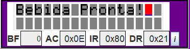

# Maquina-de-Bebidas-em-Assembly

### Letizia L. Baptistella RA 24.123.031-7 
### Rafaela Altheman de Campos RA 24.123.010-1

O objetivo deste projeto é simular em Assembly uma máquina de bebidas. Para isso, é informado as opções disponíveis e o usuário deve clicar no botão correspondente ao seu pedido para que seja informado sobre o status de preparação.

Para desenvolvimento, foi utilizado um simulador de 8051 chamado Edsim 51. Utilizmos as ferramentas que ele nos oferece e que aprendemos em aula para desenvolver a maquina de bebidas. Dentre eles estão: teclado matricial, LCD, motor e o display de 7 segmentos.

O trabalho foi desenvolvimento pensando em utilizar e dinamizar o maior numero de ferramentas do Edsim51 que pudemos usar.

Para utilizar a maquina de bebidas, ao rodar o programa, um menu das bebidas disponiveis aparece para o cliente. As opções são: água, suco, chá mate e Coca-Cola.

1- Tela de Inicio do programa:

2- Primeiras opções de bebidas:

3- Outras opções de bebidas:

4- Nesse momento o usuario deve escolher no teclado matricial a bebida que ele deseja:

5- Assim que o usuário seleciona a bebida correspondente:

6- Após isso, o display de 7 segmentos faz uma contagem regressiva para a bebida ficar pronta:

<video width="320" height="240" controls>
  <source src="display7seg.mp4" type="video/mp4">
</video

7- Assim que finalizada, o LCD informa que a preparação acabou

